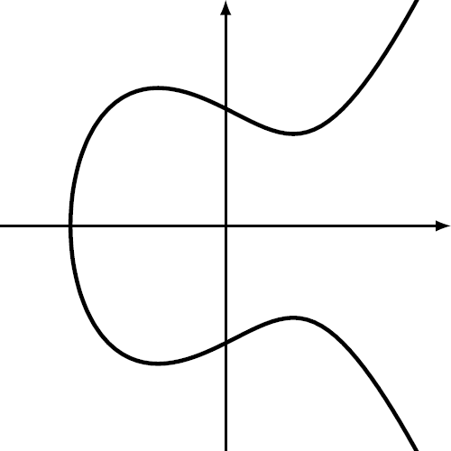
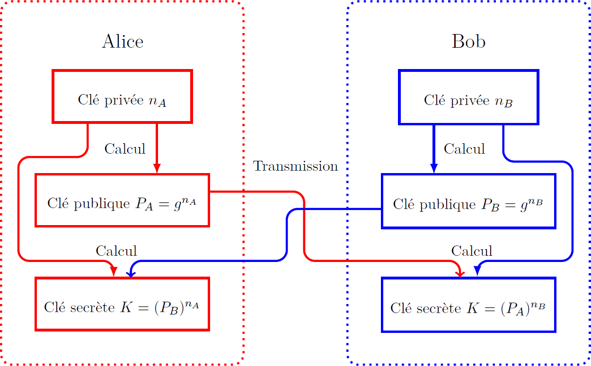
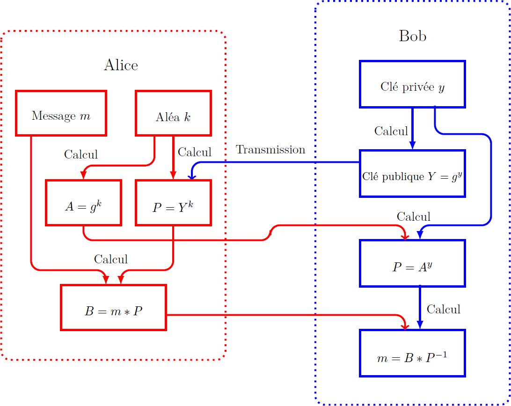

# elliptic_curve_crypto

Projet de TIPE (Travail d'initiative personnelle encadré) sur l'étude de la cryptographie sur les courbes elliptiques.

-----------------

*Une courbe elliptique*

*Échange de clés Diffie-Hellman*

*Cryptosystème de ElGamal*

-----------------

[Documentation](Documentation.pdf)

Mots clés:
* Cryptographie
* Courbes elliptiques
* ElGamal
* Elliptic Curve Diffie Hellman (ECDH)
* Elliptic curve digital signature algorithm (ECDSA)

2017-2018
